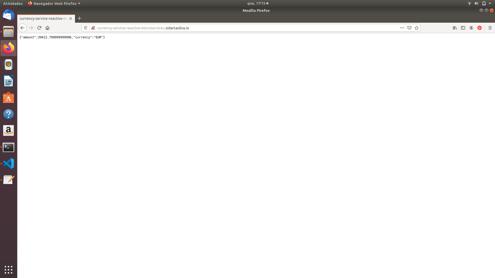
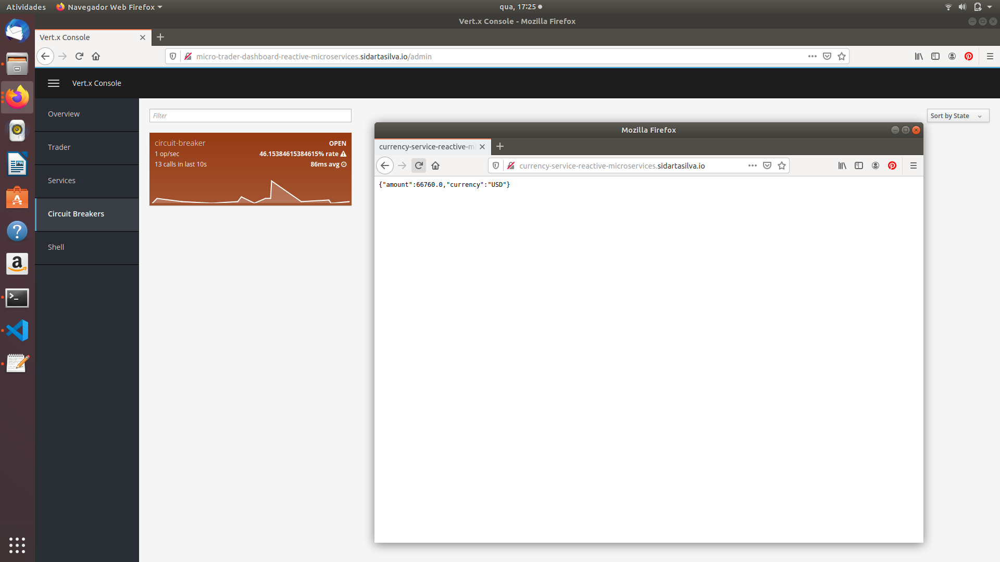
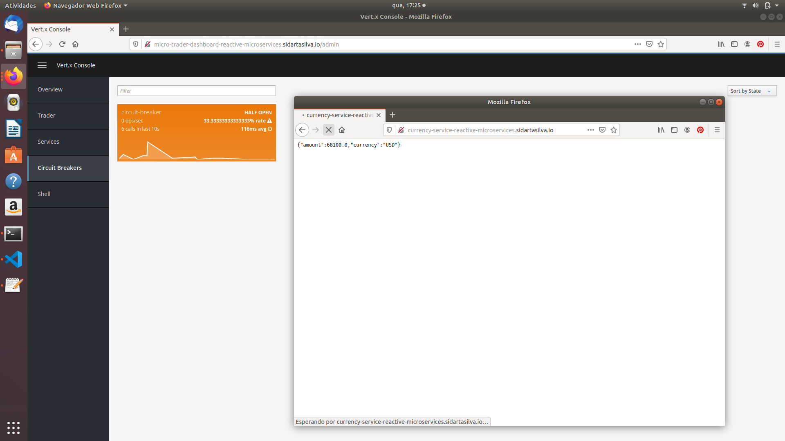
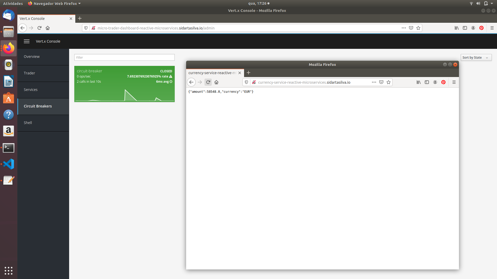

# Building Reactive Microservice Systems

This project is based mainly on the references below.

        <http://escoffier.me/vertx-kubernetes/>

        <https://vertx.io/docs/vertx-service-discovery/java/>

        <https://github.com/cescoffier/vertx-microservices-workshop>

        <https://github.com/cescoffier/vertx-kubernetes-workshop>

        <https://severalnines.com/database-blog/using-kubernetes-deploy-postgresql>

        <https://github.com/yunyu/vertx-console>
        
        ESCOFFIER, C. Building Reactive Microservices in Java Asynchronous and Event-Based Application Design. First Edition. California: O’Reilly Media, Inc., 2017.

        RedHat Developer, accessed 1 November 2019, <https://developers.redhat.com/promotions/building-reactive-microservices-in-java>

        Kubernetes Hands-On - Deploy Microservices to the AWS Cloud 2018, Udemy, accessed 1 November 2019, <https://www.udemy.com/course/kubernetes-microservices>

        <https://github.com/hazelcast/hazelcast-code-samples/>

        <https://vertx.io/docs/vertx-hazelcast>

## Resilience, Circuit Breaker and API Proxy - the Currency Service

In this project we are going to see a very common microservice pattern: Proxy. Sometimes you are relying on an external service that is not as good as you would like.

These flaky services can kill your systems, as generally the error they produce cascade into the rest of your system. It's even worse with timetout as you are waiting for a response for a long time.

In this project we are going to create a Proxy in front of a 3rd party currency service (flaky) and improve the resilience of the system by protecting calls to this service with a Circuit Breaker.

We are going go cover:

    * how to build a Proxy

    * How to use a Circuit Breaker (and what it is)

### Proxies

A Proxy is just a microservice delegating calls to another one. It may "improve" or "decorate" it, or even orchestrate different services. In that later case, we are closer to API gateways than plain proxies.

But why doing a Proxy? Well, let's take the example of a flaky service.

In this case, the user does not get the valid answer, may wait a long time to get an answer and so on. So, the Proxy must contain some "resilence" logic to isolate errors and if possible provide a fallback answer.

### Circuit Breakers

A Circuit Breaker is an object monitoring an interaction, for instance the calls between our Proxy and the flaky service. It starts in the Closed state. In this state, the Circuit Breaker forward the calls to the service and monitor the outcome (success or failures). When the Circuit Breaker reaches an amount of failure, it switches to the Open state. In this state, the service is not called anymore, but a fallback response is used. After some specific time, the Circuit Breaker goes to the Half-Open state and let the next request pass and hit the service. Depending on the result of this request, the Circuit Breaker goes back to the Open state (on failure) or the Closed state (on success).

A Circuit Breaker is a great way to protect your system against flaky services and also gives time to recover when they start failing (Open state). When the service is back on track, and thanks to the Half-Open state, your system is going to auto-recover and restart using the service.

### Task - Using the Vert.x Circuit Breaker

Open the CurrencyServiceProxy class located in the currency-service project. Jump to the delegateWithCircuitBreaker method and fill it using the inlined instructions.

            private void delegateWithCircuitBreaker(RoutingContext rc) {
                HttpEndpoint.rxGetWebClient(discovery, rec -> rec.getName().equals("currency-3rdparty"))
                        .flatMap(client ->

                            // TODO
                            // Use the Circuit Breaker (circuit) to call the service.
                            // Use the rxExecuteCommandWithFallback method.
                            // This method takes 2 parameters: the first one is a function taking a "Future" as parameter and needs
                            // to report the success or failure on this future. The second method is a function providing the fallback 
                            // result. You must provide a JSON object as response. For the fallback use:
                            // new JsonObject()
                            //      .put("amount", rc.getBodyAsJson().getDouble("amount"))
                            //      .put("currency", "USD")
                            // In the first function, use the given client, emit a POST request on / containing the incoming payload
                            // (rc.getBodyAsJson()). Extract the response payload as JSON (bodyAsJsonObject). Don't forget to subscribe
                            // (you can use subscribe(toObserver(fut)). You can have a look to the "delegate" method as example.
                            circuit.rxExecuteCommandWithFallback(
                                fut -> 
                                    client.post("/").rxSendJsonObject(rc.getBodyAsJson())
                                        .map(HttpResponse::bodyAsJsonObject)
                                        .subscribe(toObserver(fut))
                                    ,
                                err -> 
                                    new JsonObject()
                                    .put("amount", rc.getBodyAsJson().getDouble("amount"))
                                    .put("currency", "USD")
                            )
                        )
                        // ---
                        .map(JsonObject::toBuffer)
                        .map(Buffer::new)

                        .subscribe(toObserver(rc));
            }

The flaky service is located in the currency-3rdparty-service project.

### Show time

Let's see how this works.

Now, in your Browser, enter the new route host that has been created with the Kubernetes Ingress Controller: http://currency-service-reactive-microservices.sidartasilva.io. By hitting enter we should see the evaluation of our Portfolio in Euros.

As we keep hitting the Currency Service URL, we are able to see the Circuit Breaker states changing by checking the Vert.x Console's Circuit Breakers tab.

The Circuit Breaker Open state:

The Circuit Breaker Half-Open state:

The Circuit Breaker Closed state:

